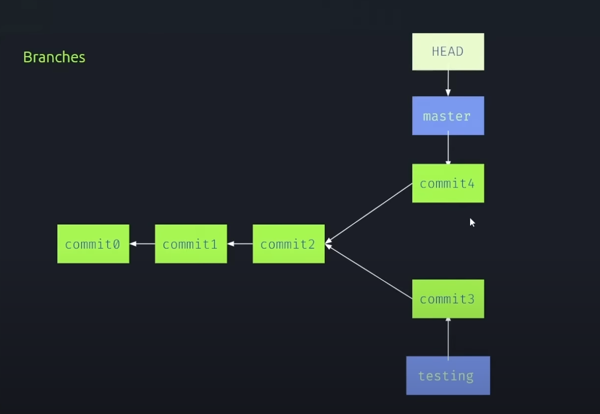

#Notas do curso de git e versionamento 

## COMANDOS

1. **git clone**:
    abrir o git na pasta que precisa
    
    (git clone +https do repositorio e o repositorio vai ser baixado na pasta)
    

2. **git init**:vai criar a pasta oculta do git, onde ele le e guarda os versionamentos 

3. **git status**: mostra com a branch e se ela esta atualizada em relação ao origin. 
   
   Mostra qual arquivo esta em estado de *MODIFIED*

4. **git add**: adiciona o arquivo na area de *STAGED*
   
5. **git diff**: mostra as linhas que foram removimas ou alteradas(vermelho) e as que foram acrescentadas (verde) (na area modified)
   
   **git diff --staged**: mostra as modificações que já estão na area de staged comparando com o atual

6. **git commit**: salva e sai da area de saged 

7. **git rm**: remove alguns arquivo da pasta (precisa colocar "git rm nome_arquivo")

8. **git log**: mostra os ultimos commits que foram feitos

9. **git restore**: volta antes da ultima alteração que foi feita num arquivo q foi salvo porem n teve um novo commit (na area modified)

    **git restore -- staged**: faz a mesma coisa, só que na area de staged

10. **git push**:"empurra" para o repositorio remoto. Estrutura: git push -u origin (ou main)

11. **git pull**: "puxa" oq tem no repositorio remoto e faz um merge entre repositorio local e remoto
    
    **marge**: junta oq tem no repositorio remoto com o que tem no repositorio local

12. **git fech**: baixa tudo que esta no repositorio remoto e NAO TEM no local porem nao coloca direto as mudança. É uma forma de vizualizar antes dar marge local
    
    pra olhar essa difença podemos usando **git dif origin/master**

    depois desses passos é interessante usar o git pull, assim temos ctz do que iremos dar o marge

## CONCEITOS

### Status do  git 

1. **Unmodified**
    o git identidicou mas ainda nao tem nenhuma mudança gravada para esse arquivo.
    Já receberam commit
2. **Modified**
    Ja aconteceu alguma mudança no arquivo, mas essa mudança ainda nao tem um commit.
3. **Staged**
    como se fosse uma area preparatoria para dar o commit 
4. **Untracked**
    Arquivo novo, sem nenhum commit 

### branches 

